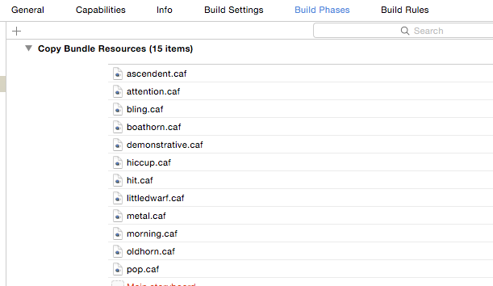

## inBeacon iOS xCode Swift and Objective-C SDK guide


This document describes the latest version of the inBeacon iOS xCode SDK

© 2016 inBeacon bv. Padualaan 8 UtrechtInc Room Z108 3584 CH Utrecht The Netherlands

## inBeacon SDK’s

Integrating inBeacon is now easier than ever. It’s a matter of pasting a few lines of code to integrate our SDK into your project. The inBeacon mobile SDK’s are available for the following platforms:

* inBeacon iOS swift and objective-c SDK		(available)
* inBeacon Android java SDK				(available)
* inBeacon Xamarin Android & iOS SDK			(available)
* inBeacon Cordova Android & iOS SDK			(available)


For other environments and platforms, the inBeacon mobile API can be addressed directly.

## Before your start: Considerations for integration

### Permissions

When the SDK is integrated into an app, the app will request some permissions from the enduser.  If the app already needed those permissions before integration of the SDK,  these permissions will not be requested again. These permissions are requested once after installation when the app is started (and the inBeacon SDK is initialized).

##### Application would like to send you notifications


##### Application would like to access your location even when you are not using the app.


It is also possible to run the SDK in "Selective Location Authorisation" mode (SDK 1.3.5 and up). In this case the SDK asks for “when in use” access only, and asks for “even when you are not using the app” mode at the moment the campaign action “ask background location-scanning permission” is triggered. (see below)

##### When bluetooth is turned off:


> After running a few days, the user gets a notification that the app is looking for beacons or geofences (even when no beacons or geofences are actually found). We found out that this message is always given in combination with message 2), and is not related to the actual location or iBeacon features used in the app.

> 

When the SDK is running in  "Selective Location Authorisation" mode, this message is not send until after the user was asked to add background scanning.

### Background mode

There are three fundamentally different ways to run the inBeacon SDK:

#### Restricted background mode

This means that if a user is moving around within a (beacon) region more than 3 minutes after entering the region, triggers will no longer work when the app is in the background.

Advantages:
- App submission to the app store is without issues about background location scanning
Extra Battery power use is limited to a minimum

Disadvantages:
- This limits the app to a maximum of 3 minutes beacon ranging after the app enters a beacon region.

#### Full background mode
For iOS, full background mode requires extra location background settings so the app is able to run continuously  in the background during iBeacon ranging.

Advantages:
- When users approach an iBeacon in Near or Immediate proximity, all inBeacon triggers and other functionality is fully supported. During the complete stay of the user in the iBeacon location, the app will monitor the range to all defined iBeacons.

Disadvantages:
- the app description in the app-store needs to include the following: "Note: Continued use of GPS and <app name> running in the background can dramatically decrease battery life. <app name> will automatically shut down if you run it in the background and leave <description of location where ibeacons are used>."
- Possibility of initial app rejection by iTunes connect (apple appstore). However in the past we were able to get all apps approved, even with full background mode ON.
-  The app uses a bit more battery power when inside beacon regions. Because location monitoring is set for least-accurate, GPS is not used by the SDK. We found that the decrease of battery life is negligible.


>iTunes application notes

>Because we use iBeacon ranging in the background  you need to include a note in your app description:

> - "Continued use of GPS running in the background can dramatically decrease battery life."

> We were able to get applications approved with the following text:
in English:
Note: Continued use of GPS and <app name> running in the background can dramatically decrease battery life. [app name] will automatically shut down if you run it in the background and leave [description of location where ibeacons are used]

> in Dutch:
Opmerking: Langdurig gebruik van GPS en <app naam> kan de levensduur van de accu drastisch verminderen. <app naam> zal automatisch afsluiten zodra u <omschrijving van de locatie waar de ibeacons worden gebruikt> verlaat.

#### Selective Location Authorisation mode

(special cases only)
In this mode the app starts by only asking for "when in use" location permissions. The app will ask for full (background) location permission only after the defined “ask bg permission” action is triggered from the campaign manager.. Selective Location Authorisation is defined on the inBeacon backend.
You can for instance ask for permission when the user activates the app within a Geofence.


Advantages:
- all advantages of restricted background mode
- only ask full permissions to a specific subset of your users

Disadvantages
- Only a subset of your users will be able to detect beacons
- all disadvantages of restricted background mode

>Important: Please note that permissions will only be asked once. If an enduser decides to decline the permission and the trigger fires for the second time, iOS will not ask the permission again.

</td>
  </tr>
</table>


Using full, restricted background mode or Selective Location Autorisation mode depends on your specific situation.

### Memory footprint

SDK without sound resources: 494kB

with sound resources: 1.07MB

### App store submission

#### Store submission rejections

In case of a rejection when using FULL BACKGROUND mode, we’ve used this plea successfully in the past:

This app using the inBeacon SDK is rejected because it uses background mode to detect beacon ranging events in the background (detect near/immediate proximities)  Other apps using the same inBeacon SDK also have background mode on, and were approved without any problems.

The problem:

We use iBeacons in several stores and we want to give the most relevant information to our customers. This means that we don't want to show the dreaded "welcome to our store" notification on region entrance, because that is not relevant to the customer at that moment.

Instead we want to give notifications when a customer is interested in specific areas of the store, for instance where an article with a discount is presented, or to present a "use your loyalty card" notification at the checkout. This way we can enhance the customer journey and start interacting at the right place in the store.

We use this system for a number of months now and with good results.

Why do we need background mode to do this?

We can detect the iBeacon region entrance and exit with the CLBeaconRegion method, however this will give us only events when the user enters/leaves our store.

So we need to start ranging in the background at the moment the iBeacon region (store) is entered and that is not possible without using a background service. otherwise our app would go to sleep after mere seconds after entering the beacon region and it will not be able to detect near or immediate proximity.

Do we use a lot of extra battery life?

We think not. If the app is outside the iBeacon region (our store), we stop our background process, so the ranging is only done inside the iBeacon region. And this is bluetooth low-energy technology, so it is relatively battery-friendly compared to GPS background mode.

Is near/immediate ranging less accurate when people have their iPhone in their pockets?

We think not. We have done excessive testing the last 6 months with hundreds of customers. Also we've added additional averaging algorithms in our code to make sure the events on the near and immediate ranges are more solid than ever.

Conclusion: We think the background ranging for near and immediate proximity is a valid technique to enhance the customer journey and allows for a more userfriendly experience.

So please reconsider the rejection.

## Integrating the inBeacon SDK in your application

You can integrate the SDK using [_CocoaPods_](https://cocoapods.org/) or [_Carthage_](https://github.com/Carthage/Carthage) dependency managers or download the framework from this [_repository_](https://github.com/inbeacon/InbeaconSdk-IOS).

**_Cocoapods_** is the preferred way to integrate, as this will minimize additional steps.

### Using CocoaPods

#### Steps

Using CocoaPods, a few application settings must be configured for correct integration of the SDK:

<table>
  <tr>
    <td>What</td>
    <td>Why</td>
  </tr>
  <tr>
    <td>1. Add the inBeaconSDK to your Podfile </td>
    <td>To get the latest version of the InbeaconSdk from cocoapods
</td>
  </tr>
  <tr>
    <td>2. Add descriptions for use of Location </td>
    <td>In iOS, iBeacon functionality makes your app location-aware. For this reason the app needs two descriptions that are shown in the permission alerts for use of Location. </td>
  </tr>
  <tr>
    <td>3. Full background mode for location updates (optional)</td>
    <td>If you choose to run your app in full background mode  you need to enable / add this setting. </td>
  </tr>
  <tr>
    <td>4. Embedded code contains Swift	</td>
    <td>Set this flag to Yes (only for objective-C projects)</td>
  </tr>
</table>


1. ##### Add the inbeacon SDK to your podfile

  Add this to your Podfile (xcode 8 from version 2.1 upwards. Xcode 7 up to version 2.0.x)
  ```ruby
  pod ‘InbeaconSdk’, '~> 2.1'
  ```
  Also make sure the "use_frameworks!" flag is supplied. A sample Podsfile:

  ```ruby
  platform :ios, '9.0'

  target 'CocoapodTest' do

         	use_frameworks!

         	pod 'InbeaconSdk', '~> 2.1'

  end
  ```
  After this run ‘pod install’ and you’re good to go.

1. ##### Add descriptions for use of Location

  Add two text items to the custom target info.

  >Note
  >Without these, the app never asks for permission to use location and inBeacon won’t function !

  

  Add: **NSLocationAlwaysUsageDescription**   

  Text that is shown under the permission dialog when asked for "even when you are not using the app" location permission (this is the default permission needed to use the inBeacon SDK)

  Optionally add: **NSLocationWhenInUseUsageDescription**  

  Text that is shown under the permission dialog when asked for "while using the app in the foreground". This is only necessary when using the 2-step “Selective Location Authorisation” mode.

  

1. ##### Full background mode for location updates (*when using full-background mode only)*

  To switch the SDK into full background mode, you will need to add location update background mode to your info.plist / application settings:

  Turn background Mode on for Location updates. This allows ranging of beacon proximities in the background at any time, and removes the 3 minutes limit on ranging after entering a region.

  

  >Note
  >Do NOT turn background mode ON when operating in Restricted-background-mode or Geofenced Location Authorisation mode.  Use this only when running the app in full-background mode for proximity ranging purposes.

1. ##### Embedded content contains swift code *(when using objective-c only)*

  The inBeacon SDK is a dynamic swift framework, and for objective-C projects, you need to set the "embedded content contains swift code" flag to ON

  


### Using Carthage

Add the inbeacon SDK to your Cartfile with
```ruby
github "inbeacon/InbeaconSdk-IOS" ~>2.0
```
And run `carthage update`. This will update the universal InbeaconSdk-IOS framework in the Carthage checkouts directory.

### Using files from the github repository

- Universal `InbeaconSdk.framework` : everything included for working with the inBeacon API Architectures in the inBeaconSdk framework are: i386 x86_64 armv7 arm64

- `bitcoded_framwork/InbeaconSdk.framework` : stripped version with only armv7 and arm64 for use with bitcode

- Resources directory with notification sounds to be copied into your app bundle

>Note
>Two example xcode projects are provided (one in objective-C and one in swift) in the example directory.


### Steps

Using Carthage or downloaded files, a few application settings must be configured for correct integration of the SDK:

<table>
  <tr>
    <td>What</td>
    <td>Why</td>
  </tr>
  <tr>
    <td>1. add the inBeacon framework
</td>
    <td>To include the SDK. Make sure the framework is embedded, as it is a dynamic framework</td>
  </tr>
  <tr>
    <td>2. add descriptions for use of Location </td>
    <td>In iOS, iBeacon functionality makes your app location-aware. For this reason the app needs two descriptions that are shown in the permission alerts for use of Location. </td>
  </tr>
  <tr>
    <td>3. add resources to your app bundle</td>
    <td>inBeacon allows you to select customized notification sounds. These files need to be in your main application bundle (notification sounds cannot be included in a framework bundle)</td>
  </tr>
  <tr>
    <td>4. Full background mode for location updates</td>
    <td>If you choose to run your app in full background mode (recommended for full iBeacon functionality) you need to enable / add this setting. </td>
  </tr>
  <tr>
    <td>5. Embedded code contains Swift	</td>
    <td>Set this flag to Yes (only for objective-C projects)</td>
  </tr>
</table>


1. ##### Add the framework to your project

  Drag the framework to your project and make sure the framework is embedded, as it is a dynamic framework. Dragging it from your project list to the "embedded binaries" chapter is sufficient as this automatically adds it to the linked-framework-and-libraries chapter

  

1. ##### Add descriptions for use of Location

  Add two text items to the custom target info.
  >Note
  >Without these, the app never asks for permission to use location and inBeacon won’t function!

  

  Add: **NSLocationAlwaysUsageDescription**   

  Text that is shown under the permission dialog when asked for "even when you are not using the app" location permission (this is the default permission needed to use the inBeacon SDK)

  Optional:**NSLocationWhenInUseUsageDescription**  

  Text that is shown under the permission dialog when asked for "while using the app in the foreground". This is only necessary when using the 2-step “Selective Location Authorisation” mode.

  

1. Bundle resources for customized notification sounds

  Customized sounds are available for local notifications. In order to use customized notification sounds, copy all files in the *./resources* directory of the SDK to your application bundle. You could do this by drag/dropping these into your "copy bundle resources" section of the Build Phases of your app:

  

  Customized sounds can be selected in the campaign action of the inBeacon backend console.

1. Full background mode for location updates (*when using full-background mode only)*

  To switch the SDK into full background mode, you will need to add location update background mode to your info.plist / application settings:

  Turn background Mode on for Location updates. This allows ranging of beacon proximities in the background at any time, and removes the 3 minutes limit on ranging after entering a region.

  

  >Note
  >Do NOT turn background mode ON when operating in Restricted-background-mode or Geofenced Location Authorisation mode.  Use this only when running the app in full-background mode for proximity ranging purposes.


1. Embedded content contains swift code

  The inBeacon SDK is a dynamic swift framework, and for objective-C projects, you need to set the "embedded content contains swift code" flag to ON

  


## Using the SDK

#### Minimal SDK code integration to get up and running


To access the inBeacon sdk framework, include the following header files:

```objc  
// Swift
import InbeaconSdk
```
```objc
// Objective-C
#import <InbeaconSdk/InbeaconSdk.h>
```

#### `CreateWith(ClientID:  ClientSecret:)`
- Initialize the SDK with your credentials

  ```swift
  //Swift
  InbeaconSdk.createWith(clientId: "<your client-ID>",clientSecret: "<your client-secret>")
  ```
  ```objc
  //Objective-C
  [InbeaconSdk createWithClientID: @"<your client-ID" andClientSecret: @"<your client-secret>"];
  ```

  Initialize the SDK with your clientID and clientSecret. These credentials are used for communication with the server.
  You can find your client-ID and client-Secret in your account overview. See [http://console.inbeacon.nl/accmgr](http://console.inbeacon.nl/accmgr)
  ##### Example:
  Initialize the SDK in your appdelegate in the didFinishLaunchingWithOptions method as follows:

  ```swift
  //Swift
  func application(application: UIApplication,didFinishLaunchingWithOptions launchOptions: [NSObject: AnyObject]?) -> Bool {

         InbeaconSdk.createWith(clientId: "<your client-ID>",clientSecret:  "<your client-secret>")
         ...
  }
  ```
  ```objc
  //Objective-C
  - (BOOL)application:(UIApplication *)application didFinishLaunchingWithOptions: (NSDictionary *) launchOptions {
      [InbeaconSdk createWithClientID: @"<your client-ID>" andClientSecret: @"<your client-Secret>"];     
      …
  }
  ```

#### `sharedInstance`

- inbeaconWithClientID:andClientSecret returns a singleton instance. You can always obtain this instance by using:

  ```objc
  //Swift and Objective-C
  InbeaconSdk.sharedInstance
  ```


#### `didReceiveLocalNotification()`

- In addition, you need to forward localnotifications to the inBeacon SDK by putting an extra method in your appdelegate:
  ```swift
  //Swift
  InbeaconSdk.sharedInstance.didReceiveLocalNotification(notification)
  ```
  ```objc
  //Objective-C
  [InbeaconSdk.sharedInstance didReceiveLocalNotification:notification];
  ```

  Forward the localnotification  in your appdelegate in the didReceiveLocalNotification method as follows:
  ```swift
  //Swift
  func application(_ application: UIApplication, didReceive notification: UILocalNotification) {
    if !InbeaconSdk.sharedInstance.didReceiveLocalNotification(notification) {
            // not handled by inbeaconSdk, so we need to handle it ourselves (or not..)
    }
  }
  ```
  ```objc
  //Objective-C
  - (void)application:(UIApplication *)application didReceiveLocalNotification:(UILocalNotification *)notification {

      if (![InbeaconSdk.sharedInstance didReceiveLocalNotification:notification]) {
            // not handled by inbeaconSdk, so we need to handle it ourselves (or not..)
      }
  }
  ```


### didReceiveUserNotification

Working with the iOS 10 UserNotification framework? In that case you can replace the **didReceiveLocalNotification** as described above with a call to **didReceiveUserNotification **

<table>
  <tr>
    <td>Swift

InbeaconSdk.sharedInstance
.didReceiveUserNotification(notification)
</td>
    <td>Objective-C

[InbeaconSdk.sharedInstance
didReceiveUserNotification:notification];
</td>
  </tr>
</table>


Forward the notification in your UserNotification delegate as follows:

<table>
  <tr>
    <td>Swift
  func userNotificationCenter(_ center: UNUserNotificationCenter,
        didReceive response: UNNotificationResponse,
        withCompletionHandler completionHandler: @escaping () -> Void) {

        If !InbeaconSdk.sharedInstance.didReceiveUserNotification(response.notification) {
                  // not handled by inbeaconSdk, so we need to handle it ourselves (or not..)
               }
        completionHandler()
  }</td>
  </tr>
  <tr>
    <td>Objective-C
  - (void)userNotificationCenter:(UNUserNotificationCenter *)center
          didReceiveNotificationResponse:(UNNotificationResponse *)response
          withCompletionHandler:(void (^)())completionHandler {

    [InbeaconSdk.sharedInstance didReceiveUserNotification: response.notification];
}</td>
  </tr>
</table>


<table>
  <tr>
    <td>Note</td>
    <td>This is the minimum setup for integrating the inBeacon SDK. </td>
  </tr>
</table>


## Full swift code example for minimal setup:

**File: AppDelegate.swift**

import UIKit

import **InbeaconSdk**

@UIApplicationMain

class AppDelegate: UIResponder, UIApplicationDelegate {

    var window: UIWindow?

    func application(application: UIApplication,

didFinishLaunchingWithOptions launchOptions: [NSObject: AnyObject]?) -> Bool {

**InbeaconSdk.createWith(clientId: ****"<your client-ID>"****, **

**clientSecret:  ****"<your client-Secret"****)**

       return true

    }


    func application(_ application: UIApplication,

           didReceive notification: UILocalNotification) {

**       InbeaconSdk.sharedInstance.didReceiveLocalNotification(notification)**

    }

}

## Full objective-C code example for minimal setup:

## File: AppDelegate.m

#import "AppDelegate.h"

@import InbeaconSdk;

@interface AppDelegate ()

@end

@implementation AppDelegate

- (BOOL)application:(UIApplication *)application

didFinishLaunchingWithOptions:(NSDictionary *)launchOptions {

**    [InbeaconSdk createWithClientID: ****@"<your client-id>"**** **

**andClientSecret: ****@"<your client-secret>"****];    **


    return YES;

}

- (void)application:(UIApplication *)application

didReceiveLocalNotification:(UILocalNotification *)notification {

**    [InbeaconSdk.sharedInstance didReceiveLocalNotification:notification];**

}

## Optional SDK features

### logLevel

The SDK can log detailed information to the console, but the amount is controlled by the logLevel.

By default, the logLevel is set to *Severe*, but you can increase the loglevel by setting it:

<table>
  <tr>
    <td>Swift

InbeaconSdk.sharedInstance.logLevel = .Verbose

enum InbLogLevel: Int, Comparable,
CustomStringConvertible {
    case verbose = 0
    case debug
    case info
    case warning
    case error
    case severe
    case none
}</td>
    <td>Objective-C

InbeaconSdk.sharedInstance.logLevel =
InbLogLevelVerbose;

typedef enum {
InbLogLevelVerbose = 0,
InbLogLevelDebug,
InbLogLevelInfo,
InbLogLevelWarning,
InbLogLevelError,
InbLogLevelSevere,
InbLogLevelNone
} InbLogLevel;</td>
  </tr>
</table>


Logging info is logged in the xcode output console.

The logging level is persistent. It is stored on the device.

The InbLogLevel enum is CustomStringConvertible, so with Swift  it is possible to display the value as a string:

<table>
  <tr>
    <td>Swift

print("Current loglevel: \(InbeaconSdk.sharedInstance.logLevel)")
</td>
    <td>Objective-C

NSLog(@”Current loglevel %d”,
 InbeaconSdk.sharedInstance.logLevel);
</td>
  </tr>
</table>


<table>
  <tr>
    <td>Note</td>
    <td>You can increase the loglevel  before calling CreateWithClientID: ClientSecret:  to see the complete logdump.</td>
  </tr>
</table>


### IDFA

The IDFA ("id for advertisers") can be used if you want to add functionality like Ad-retargeting. Because an app can’t always use the IDFA and apple might reject your app if the requirements for IDFA use are not followed.

For this reason, obtaining the IDFA is kept out of the SDK, and you need to supply it yourself. You might do this right after or before CreateWithClientID: ClientSecret:

<table>
  <tr>
    <td>Swift

IDFA: String?

InbeaconSdk.sharedInstance.IDFA =
ASIdentifierManager.shared()
.advertisingIdentifier?.uuidString

</td>
    <td>Objective-C

(NSString *) IDFA

InbeaconSdk.sharedInstance.IDFA =
[[[ASIdentifierManager sharedManager]
   advertisingIdentifier] UUIDString];

</td>
  </tr>
</table>


<table>
  <tr>
    <td>Note</td>
    <td>you need to specify the use of the IDFA on app submission. See https://developer.apple.com/news/?id=08282014a</td>
  </tr>
</table>


### User properties and tags

The inBeacon backend has user information for each device. The user information are properties that fall in any of the 3 categories:

* Fixed properties. These always exist and control specific functionality. These are the fixed properties

<table>
  <tr>
    <td>properties</td>
    <td>Description</td>
  </tr>
  <tr>
    <td>name</td>
    <td>Full user name, both first and family name. Example ‘Dwight Schulz’</td>
  </tr>
  <tr>
    <td>email</td>
    <td>User email. Example: ‘dwight@a-team.com’ </td>
  </tr>
  <tr>
    <td>gender</td>
    <td>User gender: male, female or unknown</td>
  </tr>
  <tr>
    <td>country</td>
    <td>ISO3166 country code</td>
  </tr>
  <tr>
    <td>id</td>
    <td>inBeacon unique user id (read-only)</td>
  </tr>
  <tr>
    <td>avatar</td>
    <td>URL to user avatar</td>
  </tr>
</table>


* Custom properties. You can define other properties, like "facebook-ID" or “age”

* Tags. Users can be tagged, a tag is basically a property without a value

User properties are **persistent** on the device, and also **automatically synchronized** **with the backend** and thus will even *survive an app re-install *(on both iOS and Android)

Replication with the backend works both ways: Local updates are send to the server, server updates are send to the backend. Because the device initiates the communication, updates from server to device do not occur immediately but will have to wait until the device starts the next communcation cycle.

<table>
  <tr>
    <td>Swift

Get and set user properties using a subscript on the user property of the inbeacon instance:

Let email:String?=
InbeaconSdk.sharedInstance.user["email"]

InbeaconSdk.sharedInstance.user[“name”]=”jean”


User properties can be String, Int, Double or Bool:

let age:Int =
InbeaconSdk.sharedInstance.user[“age”]
let bodyweight:Double =
InbeaconSdk.sharedInstance.user[“weight”]
let isMember:Bool =
InbeaconSdk.sharedInstance.user[“ismember”]

</td>
    <td>Objective-C

Get and set user properties using methods on the inbeacon instance:

InbeaconSdk *inbeacon =InbeaconSdk.sharedInstance;

NSString *email =
[inbeacon userStringForKey: @"email"];

[inbeacon setUserString: @“jean”
forKey: @"name"];

User properties can be NSString or NSNumber:

NSNumber *age =
[inbeacon userNumberForKey: @"age"]

[inbeacon setUserNumber: @79.9 forKey: @"weight"];
</td>
  </tr>
</table>


<table>
  <tr>
    <td>Note</td>
    <td>Properties cannot be removed once created. </td>
  </tr>
</table>


When user properties change (for instance when modified on the backend or via an API REST call to the inBeacon server ), a **inb:userinfo** notification is send, which you can process like this:

<table>
  <tr>
    <td>Swift

NSNotificationCenter.default.addObserver(
  self,
  selector: #selector(userInfoUpdated),
  name: Notification.Name(rawValue:"inb:userinfo"),
  object: nil)


@objc func userInfoUpdated(
notification: Notification) {
       guard let userInfo:Dictionary<String,String?>
= (notification.userInfo as? Dictionary<String,String?>) else {
            return
       }
       switch (userInfo["key"] ?? "")! As String {
       case "name"?:
       let newname:String=
InbeaconSdk.sharedInstance
.user["name"] ?? ""
...
       default:
            break
       }
    }
</td>
    <td>Objective-C

[[NSNotificationCenter defaultCenter]
addObserver:self selector:@selector(onUserInfoChange:) name:@"inb:userinfo" object:nil];


-(void)onUserInfoChange:
(NSNotification*)notification {

    NSDictionary *changed=[notification userInfo];
    NSString *key=[changed objectForKey:@"key"];
    if ([key isEqualToString: @"name"]) {
       // name property changed
NSString *newname=
     [inbeacon userStringForKey: @"name"];
...
    }
}

</td>
  </tr>
</table>


#### Tags

For tags, separate methods are used: hasTag, setTag and resetTag.

<table>
  <tr>
    <td>Swift

func hasTag(tag) -> Bool
func setTag(tag: String)
func resetTag(tag: String)

Example:

if InbeaconSdk.sharedInstance.user.hasTag("test") {
…
}

InbeaconSdk.sharedInstance.user.setTag(“test”)

InbeaconSdk.sharedInstance.user.resetTag(“test”)</td>
    <td>Objective-C

Example:

if ([InbeaconSdk.sharedInstance userHasTag: @”test”]){
...
}

[InbeaconSdk.sharedInstance userSetTag: @”test”];

[InbeaconSdk.sharedInstance userResetTag: @”test”];
</td>
  </tr>
</table>


### checkCapabilitiesAndRights

Helper method to see if the app has the rights to run location and notification services and test if bluetooth is turned on. Returns nil if there is no problem, or  an NSError object is returned that contains information about the issue

<table>
  <tr>
    <td>Swift

guard let error : NSError =
InbeaconSdk.sharedInstance
    .checkCapabilitiesAndRights() else {
            return  // all OK
}
// we have an NSError
error.userInfo["description"] as? String
error.userInfo["action"] as? String </td>
    <td>Objective-C

NSError *error = [InbeaconSdk.sharedInstance
checkCapabilitiesAndRights];
if (error) {
...
}
</td>
  </tr>
</table>


Errors can be one of the following (not localized, english only)

<table>
  <tr>
    <td>Description</td>
    <td>Action</td>
  </tr>
  <tr>
    <td>Location services are off
</td>
    <td>Please go to settings->location services and turn location services on for this app
</td>
  </tr>
  <tr>
    <td>Bluetooth is turned off
</td>
    <td>Please go to settings and turn bluetooth on
</td>
  </tr>
  <tr>
    <td>Notifications are off
</td>
    <td>Please go to settings->notifications and allow notifications for this app
</td>
  </tr>
</table>


<table>
  <tr>
    <td>Note</td>
    <td>Do not call this right after first time app install as user permissions can be asked by iOS at that moment and will only become available after the user has responded to those questions.
A good place to test this is on applicationWillEnterForeground
</td>
  </tr>
</table>


### checkCapabilitiesAndRightsWithAlert

A very basic method to show the user the action to take when something is not OK.

Shows an alert like this, based on **checkCapabilitiesAndRights**


<table>
  <tr>
    <td>Swift

InbeaconSdk.sharedInstance
.checkCapabilitiesAndRightsWithAlert()
</td>
    <td>Objective-C

[InbeaconSdk.sharedInstance
checkCapabilitiesAndRightsWithAlert];

</td>
  </tr>
</table>


## SDK events

The SDK sends notifications using the NSNotification mechanism. You can receive these events by creating an observer to the event, example:

<table>
  <tr>
    <td>Swift

NSNotificationCenter.default.addObserver(
  self,
  selector: #selector(userInfoUpdated),
  name: Notification.Name(rawValue:"inb:userinfo"),
  object: nil)

@objc func userInfoUpdated(
notification: NSNotification) {
guard let data:Dictionary<String,String?>
= (notification.userInfo as? Dictionary<String,String?>) else {
            return  // must be wrong
       }
       ...
}
</td>
    <td>Objective-C

[[NSNotificationCenter defaultCenter]
addObserver:self selector:@selector(onUserInfoChange:) name:@"inb:userinfo" object:nil];


-(void)onUserInfoChange:
(NSNotification*)notification {

    NSDictionary *data=[notification userInfo];

}

</td>
  </tr>
</table>


### Best practices

1. If you want your app to react on a beacon, location or geofence first check out the standard options that the inBeacon SDK offers out of the box. You can send local notifications and show webviews, images, video’s and more without using the SDK events at all. Go to the inBeacon campaign manager and set up a trigger with an action and a view.

2. If you want to react on a beacon, location or geofence and use the notifications to handle this yourself, consider the** inb:AppEvent** first.  You can set up all beacon, location and geofence triggers in the campaign manager and launch an inb:AppEvent when the user opens the local notification. This is easy and flexible, as you can change the trigger later on without changing your app. Use a specific app-event-argument for specific actions, like showing a certain page.

3. As a* last resort *you might react to** inb:location, inb:proximity or inb:geofence** events.

All events start with inb: for namespacing purposes

<table>
  <tr>
    <td>Notification</td>
    <td>Description</td>
  </tr>
  <tr>
    <td>inb:AppEvent
</td>
    <td>An app-event action has been triggered.

Userinfo:
[
"id": triggerId, (id of the trigger block)
"argument": appArgument
]
You can define an app-event in the campaign designer:


The argument that is supplied corresponds with the app-argment as given in the send-application-event box (xyzzy in this example)

You can use for instance a page-ID as app-argument to jump to a specific page location in your app.
</td>
  </tr>
  <tr>
    <td>inb:userinfo</td>
    <td>A user property has been changed by the backend
[
"Key": user-property  
]</td>
  </tr>
  <tr>
    <td>inb:region</td>
    <td>Send when entering or leaving a region (set of beacons with the same UUID)
Userinfo:
[
"rid": <id of region>,
"io": "i" or “o” ,
"uuid": region.UUIDString
]


</td>
  </tr>
  <tr>
    <td>inb:location</td>
    <td>Send when entering or leaving a location (set of beacons with the same UUID and major)

[
"uuid": uuid.UUIDString,
"major": String(major),
"io": “i” or “o”  
]
</td>
  </tr>
  <tr>
    <td>inb:proximity</td>
    <td>send when entering or leaving a proximity range
[
"uuid":uuid.UUIDString,
"major":String(major),
"minor":String(minor),
"Io": In.rawValue,   // “i” or “o”
"prox":prox.rawValue // “N”, “F”, “I” (near/far/imm)
]
</td>
  </tr>
  <tr>
    <td>inb:geofence</td>
    <td>Send when entering or leaving a geofence
Userinfo:
[
"Fid":id,            // geofence ID see inbeacon beackend
"io": io.rawValue    // “i” or “o”
]</td>
  </tr>
  <tr>
    <td>inb:trigger</td>
    <td>(internal notification)
Send when an offline trigger is fired  
[
"Id":id              // trigger ID see inbeacon backend
]
</td>
  </tr>
  <tr>
    <td>inb:didreceivelocalnotification</td>
    <td>(internal notification)
Send when a local notification is opened that was initiated by inbeacon.
[
"tid": trigger id    // trigger ID see inbeacon backend
]
</td>
  </tr>
</table>


<table>
  <tr>
    <td>Note</td>
    <td>
Instead of using the inb:region, inb:proximity, inb:location, inb:geofence or inb:trigger events, it is more flexible and easier to have your app react on inb:AppEvent and set up the corresponding trigger in the campaign designer.
</td>
  </tr>
</table>


# Troubleshooting

<table>
  <tr>
    <td>Problem</td>
    <td>Solution</td>
  </tr>
  <tr>
    <td>Compile error
dyld: Library not loaded: @rpath/libswiftCore.dylib
Reason: image not found</td>
    <td>Set "embedded content uses swift code" flag to YES in build settings</td>
  </tr>
  <tr>
    <td>Logging
🔴🔴 SDK: ##########  ###### Error: NSLocationAlwaysUsageDescription not defined in plist
</td>
    <td>include the NSLocationAlwaysUsageDescription
Value in your plist for iBeacon interactions</td>
  </tr>
  <tr>
    <td>Runtime error
dyld: Library not loaded: @rpath/InbeaconSdk.framework/InbeaconSdk
Reason: image not found
</td>
    <td>Include the framework in the “embedded libraries” section of the General tab of the target</td>
  </tr>
  <tr>
    <td>Link error:
ld: warning: ignoring file /Users/rvw/proj/iPhoneapps/xcodeProjects/test/inbeaconSDKv2testobjc/InbeaconSdk.framework/InbeaconSdk, missing required architecture x86_64 in file /Users/rvw/proj/iPhoneapps/xcodeProjects/test/inbeaconSDKv2testobjc/InbeaconSdk.framework/InbeaconSdk (2 slices)
Undefined symbols for architecture x86_64:
  "_OBJC_CLASS_$__TtC11InbeaconSdk11InbeaconSdk", referenced from:
      objc-class-ref in AppDelegate.o
ld: symbol(s) not found for architecture x86_64
</td>
    <td>You used the iphoneOS version of the framework for a simulator environment. Use the “universal” version of the framework.

The iphoneOS version only contains the arm7 and arm64 architectures. </td>
  </tr>
  <tr>
    <td>App crash
0x100149a10 <+3120>: brk    #0x1  EXC_BREAKPOINT

</td>
    <td>Make sure there are no “invisible” characters like unicode  zero-width-space in the client-ID or client-secret.

This can be the result from copy-paste from this document.</td>
  </tr>
</table>


If you are running into problems while integrating the SDK you can always create a ticket using the help button at the bottom of the screen in the inbeacon backend (console.inbeacon.nl)


Or email to [support@inbeacon.nl](mailto:support@inbeacon.nl)

# Changelog

### SDK version 2.1.2

* Support for UserNotification framework in iOS 10

### SDK version 2.1.1

* Minor fixes

### SDK version 2.1.0

* Xcode 8 / Swift 3 version

### SDK version 2.0.1

* Target iOS version brought back to 8.0 instead of 9.0

* Minor issues fixed

### SDK version 2.0.0

* Swift version of the inBeacon SDK

* New server protocol V5, more robust, efficient and with new features

* Dynamic and bitcode enabled framework

* Not compatible with 1.x.x frameworks. Changes needed if you want to upgrade

* Refresh call no longer required, is now optional

* Customer data is completely synced both ways with backend and persisted on device.

* Full implementation of geofences

* New trigger types support

* Geofenced location mode is now Selective Location Mode and can be configured in the backend using triggers and actions

### SDK version 1.3.9

* Xcode 7.3

* Added full-backgroundmode allow flag for iOS 9

### SDK version 1.3.8

* added the getBeaconState method

* SDK footprint: 353k (without sound resources)

### SDK version 1.3.7

* Customized notification sounds with sound resources

### SDK version 1.3.6

* Fixed: Authorisation enhancement not always asked when within geofence

### SDK version 1.3.5

* Geofenced Location Authorisation mode.

* inBeacon V4 mobile API

* SDK settings adjustable from backend

### SDK version 1.3.4

* bluetooth capability check

* sync bluetooth, notification and location authorisations

* sync SDK mode and validation

### SDK version 1.3.3

* Allow for restricted background mode.

* Use 3 minute backgroundtask for restricted background mode on regin enter and exit

* plist setting verification on app start

### SDK version 1.3.2

* Localnotification logging added

### SDK version 1.3.1

* Serverdata validation. Numeric, boolean and null values can now be send as string as well.

* Title bar layout for webview based actions with titlebar option

* refresh regions after user changes Authorisation status

* Log info about the number of monitored regions

* leaving a region also leaves proximity and location

* utf8 encoding for HMAC secret

### SDK version 1.3.0

* inBeacon v3 mobile API

* Allow for more than 20 locations

* auto-refresh on region enter

**SDK version 1.2.0**

* Enhanced beacon proximity and averaging filters

**SDK version 1.1.0**

* Background execution bugs fixed

* iOS 8 locationmanager bugs workarounds

### SDK version 1.0.4

* ios 8 update

### SDK version 1.0.3

* iinitial version

# SDK license

Grant of License. inBeacon bv grants to you:

(a) A nonexclusive, nontransferable, worldwide, royalty-free right and license to use, copy and distribute the Software in conjunction with the distribution of your own products (the 'Products') and

(b) A nonexclusive, nontransferable, worldwide, royalty-free right and license to use the relevant and necessary components of the Software solely to incorporate the Software into the Products.

Proprietary Rights.

inBeacon BV and its licensors own, and shall retain ownership of, all right, title, and interest to the Software, including, without limitation, all copyrights and other intellectual property rights therein. Without limiting the foregoing, the Software is protected by Dutch copyright laws and international treaty provisions. Therefore, you may not use, copy, or distribute the Software without authorization.

Restrictions.

You may not (1) modify, create derivative works of, reverse engineer, reverse compile, or disassemble the Software, except that you may modify and create derivative works based upon the sample source code included within the Software (the 'Sample Code') and distribute the modified Sample Code in connection with the Product ; (2) distribute, sell, lease, rent, lend, or sublicense any part of the Software to any third party except as expressly provided herein and as necessary to distribute the Product; (3) use the Software to develop software to upload or otherwise transmit any material containing software viruses or other computer code, files or programs designed to interrupt, destroy, or limit the functionality of any software or hardware.

You may not represent that the Products are certified or otherwise endorsed by inBeacon BV.

You will not receive any support or subscription services for the Software or any services from inBeacon BV in connection with the Software, except as expressly provided in this Agreement.
