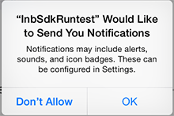

## Considerations for integration

### Onboarding process 

When the SDK is integrated into an app, the app will request some permissions.  If the app already needed those permissions before integration of the SDK,  these permissions will not be requested again. 
All iBeacon, Hyperfence and Geofence scanning will only enabled with location-access is in *Always Allow* mode, so it is important to get this onboarding process working ok.

> Note: 
> 
> * The SDK can be started with **askPermissions** set to *false*. In that case the app has control over the moment the permission dialogs are shown.

These permissions are requested (iOS 13)
once after installation when the app is started (and the Resono SDK is initialized).

##### 1. Application would like to send you notifications

##### 2. Allow Application to access your location
Always-allow authorisation is a 2 step process:

The user MUST choose "allow while using the app" here.

After the app tries to obtain the location from the background, the following message is shown automatically by iOS. Note that the user needs to choose "change to always allow". 

iOS will ask for a confirmation after the app has been running a few days after choosing the "Always allow" option. In iOS 13 this screen is presented a few times. Note that the user needs to select 'Always allow' EVERY TIME. After 3 or 4 times this is no longer asked and permission stays on 'Always allow'

### Other background services

The SDK does **NOT** need any of the info plist background modes as defined in the App capabilities. This makes app-store submissions a lot easier.

### Memory footprint

SDK without sound resources: 419kB

with sound resources: 1.07MB

`Previous:` [Home](README.md) `Next:` [Installing the SDK](installing-the-sdk.md)
