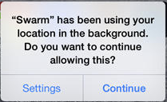

## Considerations for integration

### Permissions

When the SDK is integrated into an app, the app will request some permissions.  If the app already needed those permissions before integration of the SDK,  these permissions will not be requested again. These permissions are requested 
once after installation when the app is started (and the inBeacon SDK is initialized).

> Note: 
> 
> * The SDK can be started with **askPermissions** set to *false*. In that case the app has control over the moment the permission dialogs are shown.

All iBeacon and Geofence scanning will only enabled with location-access is in *Always Allow* mode

##### Application would like to send you notifications

##### Application would like to access your location even when you are not using the app.

> Note: 
> 
> * It is also possible to run the SDK in "Selective Location Authorisation" mode. In this case the SDK asks for “when in use” access only, and the SDK is inactive initally, until the app is opened in a defined area (geofence). Use this option by setting Resono console -> manage -> account -> settings -> device SDK settings -> Geofenced Location Authorisation to **ON**

iOS will ask for a confirmation after the app has been running a few days after choosing the "Always allow" option: 

### Other background services

The SDK does **not** need any of the info plist background modes as defined in the App capabilities.

### Memory footprint

SDK without sound resources: 419kB

with sound resources: 1.07MB

`Previous:` [Home](README.md) `Next:` [Installing the SDK](installing-the-sdk.md)
