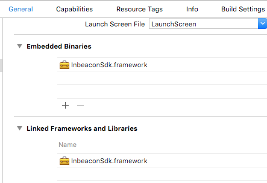

# Steps 

## Add the inbeacon SDK to your Cartfile 
```ruby
github "inbeacon/InbeaconSdk-IOS" ~>2.2
```

> Xcode 9: version ~> 2.2

> Xcode 8: version ~> 2.1

> Xcode 7: version ~> 2.0

And run `carthage update`. This will update the universal InbeaconSdk-IOS framework in the Carthage checkouts directory.

## Add the framework to your project
Drag the framework to your project and make sure the framework is embedded, as it is a dynamic framework. Dragging it from your project list to the "embedded binaries" chapter is sufficient as this automatically adds it to the linked-framework-and-libraries chapter

  

## Add descriptions for use of Location

  Add text items to the custom target info.
  >Note
  >Without these, the app never asks for permission to use location and inBeacon won’t function!

  

  Add: **NSLocationAlwaysUsageDescription**   

  Text that is shown under the permission dialog when asked for "even when you are not using the app" location permission (this is the default permission needed to use the inBeacon SDK)
  
  Add: **NSBluetoothPeripheralUsageDescription**
  
  Text that is shown under the permission dialog for accessing Bluetooth peripherals. Note that this dialog is *never* shown by the SDK, as it is only used to determine whether bluetooth turned ON or OFF. But on app submission, this item is mandatory. Standard text: "to check your bluetooth status"
  

  Optional:**NSLocationWhenInUseUsageDescription** 
  
>IMPORTANT:
>If your app calls *request​When​In​Use​Authorization()* itself, please change this into *requestAlwaysAuthorization()* as this might interfere with the request from the SDK.
 

  Text that is shown under the permission dialog when asked for "while using the app in the foreground". This is only necessary when using the 2-step “Selective Location Authorisation” mode.

  

## Bundle resources for customized notification sounds
Customized sounds are available for local notifications. In order to use customized notification sounds, copy all files in the *./resources* directory of the SDK to your application bundle. You could do this by drag/dropping these into your "copy bundle resources" section of the Build Phases of your app:

  

Customized sounds can be selected in the campaign action of the inBeacon backend console.

## Full background mode for location updates 
> Only when using full-background mode

This allows ranging of beacon proximities in the background at any time, and removes the 3 minutes limit on ranging after entering a region. To switch the SDK into full background mode, you will need to add location update background mode to your info.plist / application settings:


>Do NOT turn background mode ON when operating in Restricted-background-mode or Geofenced Location Authorisation mode.  Use this only when running the app in full-background mode for proximity ranging purposes.


## Extra build options for objective-c projects 

  The inBeacon SDK is a dynamic swift framework, and for objective-C projects, you need to set the "Always embed swift standard libraries" (xCode 8) or "embedded content contains swift code" (xCode 7) flag to "Yes"

  
  

`Previous:` [Installing the SDK](installing-the-sdk.md)   `Next:` [Using the SDK](using-the-sdk.md)
