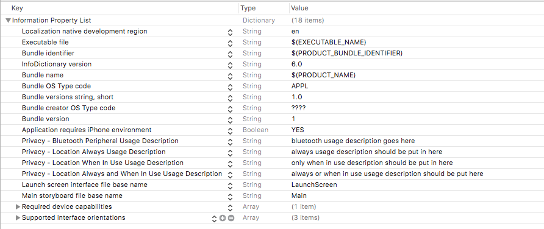
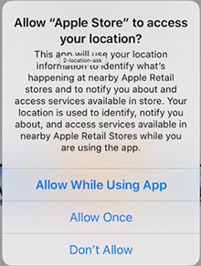
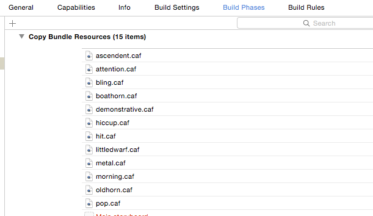
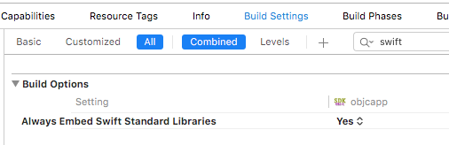

# Steps
Using [CocoaPods](https://cocoapods.org/pods/InbeaconSdk), a few application settings must be configured for correct integration of the SDK:

## Add the inbeacon SDK to your podfile
  To get the latest version of the InbeaconSdk from cocoapods, add this to your Podfile 
> Xcode 9.3: version ~> 2.3

> Xcode 9: version ~> 2.2

  ```ruby
  pod 'InbeaconSdk', '~> 2.3'
  ```
  Also make sure the "use_frameworks!" flag is supplied. A sample Podsfile:

  ```ruby
  platform :ios, '9.0'

  target 'CocoapodTest' do

         	use_frameworks!

         	pod 'InbeaconSdk', '~> 2.3'

  end
  ```
  After this run ‘pod install’ and you’re good to go.
  
## Add descriptions for use of Location 

  >Note:
  >Without these, the app never asks for permission to use location and inBeacon won’t function !
  
  Add 4 Privacy - text items to the custom target info.
  
  

  Add: **Privacy - Location Always Usage Description**  (**NSLocationAlwaysUsageDescription**) 

  Text that is shown under the permission dialog when asked for "even when you are not using the app" location permission (this is a permission needed to use the inBeacon SDK)

  Add: **Privacy - Location Always and When In Use Usage Description**   

  Text that is shown under the permission dialog when asked for "even when you are not using the app" location permission with the option of allowing when-in-use. (this is a permission needed to use the inBeacon SDK)
  

  
  Add: **Privacy - Bluetooth Peripheral Usage Description** (**NSBluetoothPeripheralUsageDescription**)
  
  Text that is shown under the permission dialog for accessing Bluetooth peripherals. Note that this dialog is *never* shown by the SDK, as it is only used to determine whether bluetooth turned ON or OFF. But on app submission, this item is mandatory. You can use a standard text: "to check your bluetooth status"
  
  add: **Privacy - Location When in Use Usage Description**  (**NSLocationWhenInUseUsageDescription**)

  Text that is shown under the permission dialog when asked for "while using the app in the foreground". This is only necessary when using the 2-step “Selective Location Authorisation” mode.


## Bundle resources for customized notification sounds

Customized sounds are available for local notifications. In order to use customized notification sounds, copy all files in the *./resources* directory of the SDK to your application bundle. You could do this by drag/dropping these into your "copy bundle resources" section of the Build Phases of your app:



Customized sounds can be selected in the campaign action of the inBeacon backend console.    


## Extra build options for objective-c projects 

  The inBeacon SDK is a dynamic swift framework, and for objective-C projects, you need to set the "Always embed swift standard libraries" 
  
  


`Previous:` [Installing the SDK](installing-the-sdk.md)   `Next:` [Using the SDK](using-the-sdk.md)