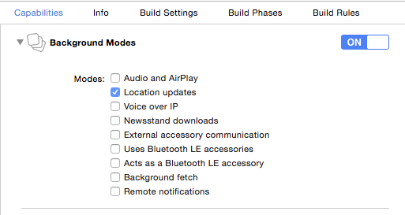

# Steps
Using [CocoaPods](https://cocoapods.org/pods/InbeaconSdk), a few application settings must be configured for correct integration of the SDK:

## Add the inbeacon SDK to your podfile
  To get the latest version of the InbeaconSdk from cocoapods, add this to your Podfile 
  > xcode 8 from version 2.1 upwards. For Xcode 7 use version 2.0.x

  ```ruby
  pod 'InbeaconSdk', '~> 2.1'
  ```
  Also make sure the "use_frameworks!" flag is supplied. A sample Podsfile:

  ```ruby
  platform :ios, '9.0'

  target 'CocoapodTest' do

         	use_frameworks!

         	pod 'InbeaconSdk', '~> 2.1'

  end
  ```
  After this run ‘pod install’ and you’re good to go.
  

## Add descriptions for use of Location


  >Note:
  >Without these, the app never asks for permission to use location and inBeacon won’t function !
  
  Add text items to the custom target info.
  
  

  Add: **NSLocationAlwaysUsageDescription**   

  Text that is shown under the permission dialog when asked for "even when you are not using the app" location permission (this is the default permission needed to use the inBeacon SDK)

  Add: **NSBluetoothPeripheralUsageDescription**
  
  Text that is shown under the permission dialog for accessing Bluetooth peripherals. Note that this dialog is *never* shown by the SDK, as it is only used to determine whether bluetooth turned ON or OFF. But on app submission, this item is mandatory. You can use a standard text: "to check your bluetooth status"
  
  Optionally add: **NSLocationWhenInUseUsageDescription**  

  Text that is shown under the permission dialog when asked for "while using the app in the foreground". This is only necessary when using the 2-step “Selective Location Authorisation” mode.

  

## Full background mode for location updates 
  > Only when using full-background mode

  If you choose to run your app in full background mode you will need to add location update background mode to your info.plist / application settings:

  Turn background Mode on for Location updates. This allows ranging of beacon proximities in the background at any time, and removes the 3 minutes limit on ranging after entering a region.

  

  >Note
  >Do NOT turn background mode ON when operating in Restricted-background-mode or Geofenced Location Authorisation mode.  Use this only when running the app in full-background mode for proximity ranging purposes.

## Embedded content contains swift code 
  > xCode 7, only when using objective-c 

  The inBeacon SDK is a dynamic swift framework, and for objective-C projects, you need to set the "embedded content contains swift code" flag to ON

  


`Previous:` [Installing the SDK](installing-the-sdk.md)   `Next:` [Using the SDK](using-the-sdk.md)